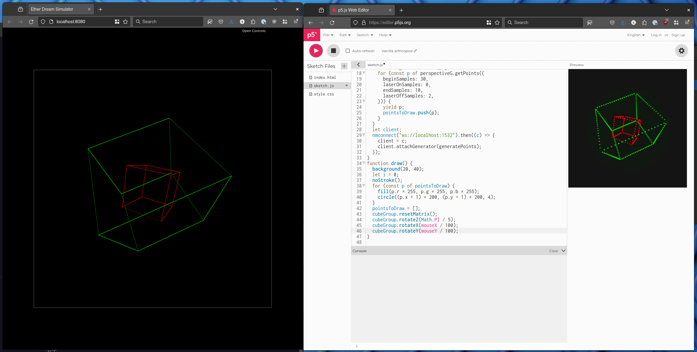

# nanometer 🔴🟢🔵


A micro framework for controlling ILDA show lasers with JavaScript/TypeScript
over WebSockets, with a focus on delivering a stream of points.

Based on [`@laser-dac`](https://github.com/Volst/laser-dac) which is doing
much of the heavy lifting here.

## Setup

```bash
npm i
```

## Example

### Run the server

```bash
npx ts-node src/server.ts
```

The server will print the URL of a laser simulator you can visit in your web
browser. If you have an [Ether Dream](https://ether-dream.com/)
attached you can set the `USE_ETHER_DREAM` environment variable to a truthy
value and it will use it in addition to providing you with a simulator.

### Connect a client

```bash
npx ts-node src/sin.ts  # Math.sin example
```

### [p5.js](https://p5js.org/)



You can connect a p5js sketch to the Nanometer server. See the
[included example](https://editor.p5js.org/sharp/sketches/H3moGj3DP) in
`examples/p5`.
